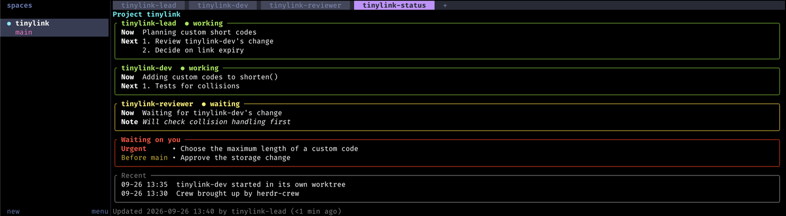
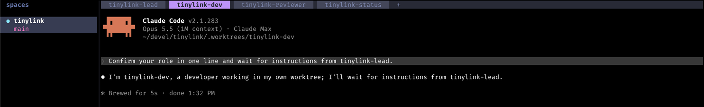

# herdr-crew

**Bring up a team of Claude Code sessions, one per role, from a file you keep in the repository.**

herdr-crew is a [herdr](https://herdr.dev/) plugin. You describe the project's roles once in `.herdr/crew.toml`: their prompts, whether each works in its own git worktree, and which one coordinates. After that, `cd repo && herdr` opens the project's workspace with a tab per role running `claude`, plus a tab with a live status board.



- **One command, idempotent.** `up` creates the workspace, the role tabs and their worktrees, and starts each agent with its prompt. Run it again and it only fills in what is missing; it never starts a second agent for a live role.
- **Starts with herdr.** With the plugin installed, herdr's startup hook brings the project up in the workspace herdr opens. After a herdr restart it repairs only the board and leaves the resumed sessions alone.
- **More hands on demand.** `add` and `close` add or remove extra instances of a role (`dev-2`, `dev-3`…), each in its own worktree if the role asks for one.
- **A status board.** `board` draws `.herdr/status.json`, which the coordinating role keeps up to date, and validates it against a schema generated from `crew.toml`.
- **Checked configuration.** Unknown keys and placeholders are errors reported with line and column, all at once.

The design, with its decisions and the herdr behaviour they rely on, is in [docs/design.md](docs/design.md).

## Requirements

- herdr 0.9.1 or later, on macOS or Linux
- Rust (stable) with `cargo`: herdr builds the plugin from source when it installs it
- `git` and `claude` (Claude Code) on the `PATH`

## Install

From the [herdr plugin marketplace](https://herdr.dev/plugins/):

```sh
herdr plugin install rarce/herdr-crew
```

herdr clones the repository and runs `sh scripts/build.sh --install-launcher`. This builds the plugin at `bin/herdr-crew` and installs a small public launcher as `~/.local/bin/herdr-crew`. Use `--ref <tag>` to pin a release.

If `~/.local/bin` is not on your `PATH`, add it to your shell configuration. To choose another directory when installing, set `CREW_BIN_DIR` to an absolute path. Relative or empty values are rejected before building because herdr installs from a temporary checkout:

```sh
CREW_BIN_DIR="$HOME/bin" herdr plugin install rarce/herdr-crew
```

The launcher asks herdr for the registered plugin location on each call, including when no server is running. Reinstalling the plugin therefore updates the CLI it runs. It also supports older installed plugins whose binary is still under `target/release/`. An existing command or symlink that is not an owned launcher is preserved; choose another directory if its name conflicts.

From a checkout, for development:

```sh
git clone https://github.com/rarce/herdr-crew
cd herdr-crew
sh scripts/build.sh
herdr plugin link "$PWD"
# Optional: expose the linked plugin as herdr-crew on your PATH.
target/release/herdr-crew-launcher --install-launcher
```

`plugin link` does not build anything, so run `sh scripts/build.sh` after each update. Without `--install-launcher`, the script only prepares the checkout. The binary's `check` command validates the configuration, prints its location and warns when a running herdr server means `herdr` will only attach.

The binary also works without a registered plugin: run `/path/to/checkout/bin/herdr-crew up` from inside the project, or use `--root`.

Remove the public launcher and the plugin with:

```sh
herdr-crew --uninstall-launcher
herdr plugin uninstall herdr-crew
```

Launcher removal also works after the plugin has been uninstalled. Use `--bin-dir DIR` to select a directory explicitly; otherwise an installed launcher removes itself, with `CREW_BIN_DIR` taking precedence. `herdr-crew --launcher-help` lists these maintenance options without needing the plugin.

## Quick start

1. Run `herdr-crew init` inside your Git repository to choose a workflow and create `.herdr/crew.toml`. Review the generated prompts. You can also write [the configuration](#herdrcrewtoml) yourself.
2. Run `herdr-crew check` from the repository, or `herdr-crew up --dry-run` to see the plan.
3. Start herdr from the repository with no herdr server running: `cd repo && herdr`. The startup hook creates the workspace, the role tabs and the board when herdr opens its initial workspace there.

If a herdr server is already running, `herdr` only attaches and its startup hook does not run. Focus this project's workspace and invoke the `herdr-crew.up` action (or run `herdr plugin action invoke herdr-crew.up`). If the project has no workspace yet, run `herdr-crew up --no-attach` from its directory. This also covers a restored server that ignored the project's launch directory. Without the public launcher, find `plugin_root` with `herdr plugin list --plugin herdr-crew --json` and run `<plugin_root>/bin/herdr-crew` directly. A live agent in an unrelated tab such as `1` will prevent new roles from starting; rename that tab to its role if it belongs to the crew, or close it after saving its work.

Each role's tab runs `claude` with its prompt, in the main checkout or in its own worktree, and gets the `start_message` as its first message:



The first time `claude` runs in a folder, it asks whether you trust it; answer in each new tab, including each new worktree. The `start_message` is sent anyway and runs once you answer.

**Trust.** Plugins listed in the herdr marketplace are not reviewed. herdr-crew runs `claude`, `git` and `herdr` on your machine with the prompts in your `crew.toml`; read the source before installing it.

## Configure a crew

```sh
herdr-crew init
```

The wizard asks for a project name, a workflow, worktree settings and generated-file ignore rules. It previews the complete configuration before saving. It does not overwrite an existing `crew.toml`, start sessions, create worktrees or fetch remote branches. Cancellation and `--dry-run` leave the project unchanged.

| Preset | Agent sessions | Use it for |
| --- | --- | --- |
| `solo` (default) | One developer | Focused fixes and sequential implementation |
| `review` | Lead, developer, reviewer | Explicit review and acceptance of a delivery |
| `parallel` | Lead, two developers, reviewer | Independent components with agreed interfaces |
| `research` | Lead, two researchers | Competing hypotheses and evidence before implementation |

These presets are practical starting points, informed by [workflow research and role guidelines](docs/workflows.md). Each prompt defines ownership, evidence to deliver, review and integration. The first role writes the board. All base roles start with `up`; prompts tell them to wait for an explicit task. Communication and task assignment remain part of your team's process.

Use `--yes` for non-interactive setup. Preview a parallel crew with:

```sh
herdr-crew init --preset parallel --name payments --base origin/main --yes --dry-run
```

Remove `--dry-run` to save it. `--name` sets the workspace label and role prefix: 1–21 characters, starting with a lowercase letter, followed by lowercase letters, digits, `_` or `-`. Choose a prefix unique among your projects; the default comes from the repository directory.

`review` normally isolates both developer and reviewer in worktrees; `parallel` always does. The wizard suggests a locally known remote branch. `--base REMOTE/BRANCH` must name a configured remote and a valid branch; ensure that branch exists on the remote before starting sessions. No local changes are copied into new worktrees. Without a remote, use `solo`, `research`, or shared-checkout review:

```sh
herdr-crew init --preset review --shared-checkout --yes
```

Generated board files, prompts and optional `.worktrees/` entries are appended to `.gitignore`, preserving its contents. Use `--no-ignore` to manage those rules yourself. `.herdr/crew.toml` remains versionable. Calls from subdirectories or worktrees configure the main checkout; `--root DIR` selects another project. Submodules and main checkouts with separate Git metadata are supported. If a linked worktree's main checkout cannot be identified safely, run setup from the main checkout instead.

## Usage

```text
herdr-crew [--root DIR] <command>
  init [--preset solo|review|parallel|research] [--name NAME]
       [--base REMOTE/BRANCH] [--shared-checkout] [--no-ignore] [--yes] [--dry-run]
                                 configure a crew with the setup wizard
  up [--no-attach] [--dry-run]   start or complete the project's sessions
  add <role>                     add an extra instance of a role with extra = true
  close <name>                   close the tab of an extra instance (keeps its worktree)
  board [--file PATH] [--once] [--interval S]
                                 draw the status board
  check                          validate the configuration and the dependencies
  startup                        herdr's startup hook: bring up or repair the projects in herdr
```

- **`cd repo && herdr`.** With no herdr server running, herdr may open an initial workspace in the repository, which the startup hook brings up. On a restore, the hook repairs only existing project workspaces: it relaunches no role and does not recreate a tab you closed. If herdr ignores the launch directory because it restored a different workspace, or if it attaches to an already-running server, use the `herdr-crew.up` action or the binary's `up` command as described above. `startup` writes to the plugin log (`herdr plugin log list --plugin herdr-crew`) and notifies when adoption fails.
- **Where the project is.** The project root is the main checkout of the git repository around the current directory, or around `--root`, even when called from a worktree.
- **The `herdr-crew.up` action.** It works on the workspace you have focused in herdr.
- **Starting the server.** From a plain terminal, `up` starts a herdr server if none is running and then opens herdr. Pass `--no-attach` to skip opening it.
- **`--dry-run`** prints each role's verdict and the steps `up` would take, without doing anything.

**No-parameter actions.** herdr actions take no parameters, so `add` and `close` are not actions. There is also a trap: an action invoked with `herdr plugin action invoke` acts on whichever workspace is focused, not on the caller's. So agents and scripts run the binary directly: `{{LAUNCHER}} up` or `{{LAUNCHER}} add <role>` in a prompt (see `{{LAUNCHER}}` below), never `plugin action invoke`.

## `.herdr/crew.toml`

```toml
version = 1

# Optional: appended to every role's prompt, after a blank line.
common_prompt = '''
The status board is {{STATUS}} (format in {{SCHEMA}}); only globex-lead writes it.
'''

# Optional: the first message of each new conversation. Without one, a role nobody has written
# to yet has no saved conversation and a herdr restart cannot resume it.
start_message = '''Confirm your role in one line and wait for instructions from globex-lead.'''

[workspace]
label = "globex"                  # the herdr workspace label

[board]
tab = "globex-status"             # the board tab's label
file = ".herdr/status.json"       # relative to the root (default)
writer = "globex-lead"            # the only role that writes the board

[worktrees]                       # only needed if a role has worktree = true
dir = ".worktrees"                # relative to the root; ignore it in git
base = "origin/main"              # fetched, then `git worktree add --detach` on it

[[roles]]                         # tab order and board order
name = "globex-lead"
prompt = '''
You are {{NAME}}, the lead, in {{REPO}}. When more hands are needed, and only after the user
agrees, run: {{LAUNCHER}} add globex-dev
'''

[[roles]]
name = "globex-dev"
prompt = '''
You are {{NAME}}, a developer working in your own worktree.
'''
worktree = true                   # works in .worktrees/globex-dev
extra = true                      # allows globex-dev-2, globex-dev-3…
```

**Keys:**

| Key                | Required         | Meaning                                                                                                                                                                                             |
| ------------------ | ---------------- | --------------------------------------------------------------------------------------------------------------------------------------------------------------------------------------------------- |
| `version`          | yes              | Always `1`.                                                                                                                                                                                         |
| `common_prompt`    | no               | Text appended to every role's prompt.                                                                                                                                                               |
| `start_message`    | no               | The first message of each new conversation, one line of at most 200 bytes. Sent only when a tab is created (`up`, the startup hook's first bring-up, `add`), never on a resume or a repair. It costs one request per role on every fresh start, so it should not ask for changes to the tree. |
| `workspace.label`  | yes              | The workspace label; `up` only touches the workspace with this label.                                                                                                                              |
| `board.tab`        | yes              | The board tab's label; must differ from every role name.                                                                                                                                           |
| `board.file`       | no               | The board file, relative to the root. Default `.herdr/status.json`.                                                                                                                                 |
| `board.writer`     | yes              | The role that writes the board; must be one of `roles`.                                                                                                                                            |
| `worktrees.dir`    | with worktrees   | Where role worktrees live, relative to the root.                                                                                                                                                    |
| `worktrees.base`   | with worktrees   | `remote/branch` that new worktrees start from, detached.                                                                                                                                            |
| `roles[].name`     | yes              | The tab label and the agent name: `[a-z][a-z0-9_-]{0,31}`, at most 29 characters with `extra`. Prefix names with the project's so they don't clash with other projects' agents, which are global in herdr. |
| `roles[].prompt`   | yes              | The role's prompt.                                                                                                                                                                                 |
| `roles[].worktree` | no               | `true` to work in `<worktrees.dir>/<name>`.                                                                                                                                                         |
| `roles[].extra`    | no               | `true` to allow `add` and `close` of `<name>-N` instances.                                                                                                                                          |
| `roles[].start_message` | no          | Replaces `start_message` for this role; `""` means none.                                                                                                                                            |

**Prompts.**

- A session's prompt is its role's `prompt`, then `common_prompt`, with these placeholders replaced:

  | Placeholder    | Value                                   |
  | -------------- | --------------------------------------- |
  | `{{NAME}}`     | the session name, such as `globex-dev-2` |
  | `{{REPO}}`     | the root                                |
  | `{{STATUS}}`   | `board.file`                            |
  | `{{SCHEMA}}`   | `.herdr/status.schema.json`             |
  | `{{LAUNCHER}}` | the binary's absolute path              |

- The result is written to `.herdr/prompts/<name>.txt` and passed with `claude --append-system-prompt-file`.
- Use literal strings (`'''…'''`): they keep backslashes as written. Basic strings (`"""…"""`) are accepted too.

**Validation.** Unknown keys and unknown placeholders are errors, and every error is reported at once with its line and column:

```text
herdr-crew: /path/to/repo/.herdr/crew.toml:22:9: roles[0].prompt: unknown placeholder {{LAUNCH}}
```

Add the generated files to `.gitignore`:

```gitignore
/.herdr/status.json
/.herdr/status.json.tmp
/.herdr/status.schema.json
/.herdr/prompts/
```

## The status board

The coordinating role (`board.writer`) keeps `.herdr/status.json` up to date, writing it atomically (to a `.tmp` file, then renaming). `up` generates `.herdr/status.schema.json` from `crew.toml`, and the descriptions in that schema tell the writer what each field means. If the file is missing, `up` seeds it.

```json
{
  "$schema": "status.schema.json",
  "version": 1,
  "updatedAt": "2026-09-25T10:40:00-03:00",
  "updatedBy": "globex-lead",
  "sessions": [
    {
      "role": "globex-lead",
      "state": "working",
      "now": "Planning the next step",
      "next": ["Review globex-dev's change"]
    },
    {
      "role": "globex-dev-2",
      "state": "waiting",
      "now": "Waiting for review",
      "next": [],
      "note": "Blocked on the fixture question",
      "updatedAt": "2026-09-25T10:30:00-03:00"
    }
  ],
  "owner": {
    "urgent": [],
    "beforeMain": ["Approve the release notes"],
    "optional": []
  },
  "recent": [{ "at": "2026-09-25T10:15:00-03:00", "text": "globex-dev pushed the fix" }]
}
```

The fields follow these rules:

- **Each session** needs `role`, `state`, `now` and `next` (a list, possibly empty); `note` and `updatedAt` are optional.
- **`state`** is `working`, `waiting`, `idle` or `blocked`.
- **`role`** is a role name, or `<extra role>-N` with N ≥ 2. Each role appears at most once.
- **`updatedBy`** must be `board.writer`.
- **Dates** are RFC 3339 with an offset.
- **Sessions** are drawn in `roles` order, each extra instance after its base role.
- **`owner`** lists what the sessions are waiting on from the user; the board shows it as "Waiting on you".

When the file is missing, has invalid JSON or does not match the schema, the board shows why instead of the content. Keys: `q`/`Esc` quit, `r` redraws.

## Development

```sh
cargo fmt --check
cargo clippy --locked -- -D warnings
cargo clippy --locked --all-targets -- -D warnings
cargo test --locked
sh scripts/build.sh
```

**Board snapshots.** Board drawings are compared with `tests/snapshots/`; `UPDATE_SNAPSHOTS=1 cargo test` rewrites them.

**Setup tests.** `tests/init.rs` checks each preset, previews, cancellation, existing files, ignore updates and configuration from a worktree using temporary Git repositories. Setup never starts herdr or agents.

**Real-herdr test.** `tests/real_herdr.rs` is ignored by default. It runs against a real herdr with its XDG directories in a short temporary directory. It starts its own `herdr --session crewtest` server there, uses `cat` instead of `claude`, and removes everything when it ends:

```sh
CREW_REAL_HERDR=1 cargo test --test real_herdr -- --ignored --nocapture
```

**Launcher tests.** `tests/launcher.rs` checks install prefixes, checkout relocation, registry changes, argument forwarding and removal with temporary tools. Its optional real-herdr test checks the offline registry without starting a server:

```sh
CREW_REAL_HERDR=1 cargo test --locked --test launcher -- --ignored
```

Both real-herdr tests clear inherited `HERDR_*` and `CLAUDE*` variables and use temporary configuration. The session test also checks its socket location before starting agents; neither modifies the user's herdr configuration.

## License

[MIT](LICENSE). herdr-crew is an independent project, not affiliated with herdr or Anthropic.
